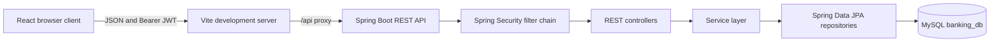

# Banking System Architecture

This document describes the current implementation of the Banking System maintained by Abazar Adam. It is intended as a technical reference for development, debugging, extension, and deployment planning.

## 1. System Overview

The application is a two-part system:

1. A Spring Boot REST API on port `8080`.
2. A React single-page application served by Vite on port `5173`.

The browser communicates with the backend through JSON HTTP requests. The frontend stores the JWT and user ID in browser local storage. The backend stores users, accounts, and transactions in MySQL through Spring Data JPA and Hibernate.



## 2. Repository Layout

```text
banking-system/
├── pom.xml                         Backend dependencies and build
├── mvnw / mvnw.cmd                 Maven Wrapper
├── db/schema.sql                   MySQL schema and migration SQL
├── src/main/java/com/bankingsystem/
│   ├── BankingSystemApplication.java
│   ├── config/                     Security, JWT, CORS, cache, mail, rate limit
│   ├── controller/                 HTTP endpoint adapters
│   ├── dto/                        Request and response contracts
│   ├── exception/                  Domain exceptions and HTTP mapping
│   ├── model/                     JPA entities and enums
│   ├── repository/                 JPA persistence interfaces
│   ├── service/                    Business operations
│   └── util/                       JWT utility
├── src/main/resources/
│   └── application.yaml            Runtime configuration
└── banking-frontend/
    ├── package.json
    ├── vite.config.js
    └── src/
        ├── api/                    Axios API modules
        ├── components/             Shared visual components
        ├── context/                Auth and account state
        ├── pages/                  User and admin screens
        ├── routes/                 Authentication and role guards
        └── utils/                  Client-side PIN helpers
```

## 3. Backend Layers

### Configuration layer

`SecurityConfig` creates the stateless Spring Security filter chain. CSRF is disabled because the API uses bearer tokens rather than cookie sessions. CORS accepts the configured frontend origins. Public authentication and API documentation routes are permitted; account, transaction, user, and admin APIs require authentication.

`@EnableMethodSecurity` activates method-level authorization. `AdminController` uses `@PreAuthorize` for the admin boundary, and the role-update endpoint adds a `SUPER_ADMIN` requirement.

`JwtAuthenticationFilter` reads the `Authorization: Bearer <token>` header. It validates the token, extracts the subject and role, normalizes roles to Spring's `ROLE_*` convention, and places a `UsernamePasswordAuthenticationToken` in the security context.

### Controller layer

Controllers translate HTTP requests into service calls and return DTOs or domain responses. They do not own database logic.

- `AuthController`: registration and login.
- `UserController`: authenticated profile lookup.
- `AccountController`: account creation, balance, deposits, withdrawals, and atomic transfers.
- `TransactionController`: account transaction history, filtering, and analytics.
- `AdminController`: administrative users, accounts, transactions, and statistics.
- `FileController`: file upload support.

### Service layer

Services contain business rules and coordinate repositories.

- `AuthService` hashes registration passwords, assigns the default `USER` role, checks credentials, and blocks locked users.
- `UserService` loads users by numeric database ID.
- `AccountService` owns balance changes, account lookup, frozen-account checks, ownership checks, and atomic transfers.
- `TransactionService` creates transaction records and resolves either numeric account IDs or UUID account numbers.
- `AdminService` composes administration summaries and performs role, lock, PIN, balance, freeze, transaction, and statistics operations.

### Repository layer

Repositories extend `JpaRepository`:

- `UserRepository<User, Long>` supports email lookup.
- `AccountRepository<Account, Long>` supports owner lookup and UUID account-number lookup.
- `TransactionRepository<Transaction, Long>` supports account/type queries and pagination.

The application intentionally keeps `userId` and `accountId` as scalar foreign-key values in the entity model. Owner details are composed in `AdminService` when administration responses are built.

## 4. Data Model

### User

The `users` table contains:

- `id`: auto-increment `BIGINT` primary key.
- `name`: display name.
- `email`: unique login identifier.
- `password`: BCrypt hash.
- `role`: `USER`, `ADMIN`, or `SUPER_ADMIN`.
- `locked`: prevents authentication when true.
- `created_by`: optional ID of the administrator that changed the role.
- `transfer_pin`: optional BCrypt hash for server-side admin PIN resets.

The `User` entity uses `@Entity`, `@Table`, `@GeneratedValue`, `@Column`, and `@Enumerated(EnumType.STRING)`.

### Account

The `accounts` table contains:

- `id`: auto-increment `BIGINT` primary key.
- `account_number`: UUID string shown to users and accepted for transfers.
- `account_type`: `SAVINGS` or `CURRENT`.
- `balance`: numeric balance.
- `user_id`: owning user's ID.
- `frozen`: prevents money movement.

The account number and database ID are separate identifiers. The public UI can display the UUID while the backend resolves it to the numeric primary key.

### Transaction

The `transactions` table contains:

- `id`: auto-increment primary key.
- `account_id`: affected account ID.
- `amount`: movement amount.
- `transaction_type`: `CREDIT`, `DEBIT`, `TRANSFER`, or `ADMIN_ADJUSTMENT`.
- `transaction_date`: creation timestamp.

The entity maps the transaction type as a string and uses a sufficiently wide column for `ADMIN_ADJUSTMENT`.

## 5. Authentication Flow

### Registration

1. The frontend posts name, email, password, and client-side PIN data.
2. `AuthController` builds a `User` entity.
3. `AuthService` BCrypt-hashes the password.
4. The new user receives the `USER` role.
5. JPA persists the user.
6. The frontend stores its local PIN hash for the current PIN workflow.

### Login

1. The frontend posts email and password to `/api/auth/login`.
2. `AuthService` loads the user by email.
3. Locked users are rejected.
4. BCrypt verifies the password.
5. `JwtUtil` signs a token containing the user ID as subject and the role as a claim.
6. The frontend stores the token and user ID.
7. The frontend loads the user profile and owner account.

The JWT secret is treated as UTF-8 bytes. It must be at least 32 bytes for HS256 and should be a long random environment value in production.

### Authorization

The JWT filter converts `ADMIN` to `ROLE_ADMIN` and `SUPER_ADMIN` to `ROLE_SUPER_ADMIN`. Spring method security then evaluates expressions such as:

```java
@PreAuthorize("hasRole('ADMIN') or hasRole('SUPER_ADMIN')")
```

The frontend also hides admin routes from normal users, but backend authorization remains the source of truth.

## 6. Account Lifecycle and Rehydration

The account context is deliberately keyed to the authenticated `userId`, not only to local storage. Logout clears cached account data. On the next login, the frontend calls:

```text
GET /api/accounts/user/{userId}
```

The backend executes `findFirstByUserIdOrderByIdAsc`. While the request is in flight, user pages show a loading state instead of incorrectly rendering `No account`. The returned account is stored locally and used for balance and transaction requests.

This implementation currently exposes the first account owned by a user in the normal user interface. The admin interface lists all accounts.

## 7. Transfer Design

The transfer endpoint is:

```text
POST /api/accounts/transfer
```

Example:

```json
{
  "fromAccountId": "1",
  "toAccountId": "3d060eab-1a89-4fa9-a7d8-f8bcd32f2b31",
  "amount": 100.00
}
```

The service resolves each reference as follows:

1. Try numeric database ID.
2. If it is not numeric, search `account_number`.
3. Verify the source belongs to the authenticated user.
4. Reject the same source and destination.
5. Reject frozen accounts.
6. Verify sufficient balance.
7. Debit the source and credit the destination.
8. Save source debit and destination credit transaction records.
9. Commit the operation inside one transaction.

This replaced the earlier frontend sequence of separate withdraw and deposit requests. The single transaction boundary prevents a recipient failure from leaving the sender debited.

## 8. Administration Design

`AdminController` exposes:

- User list and user details with owned accounts.
- Role changes for users other than the actor.
- User lock and unlock.
- Transfer PIN reset.
- Account list with owner information.
- Account detail lookup.
- Balance adjustments with `ADMIN_ADJUSTMENT` records.
- Account freeze and unfreeze.
- Transaction monitoring with optional user, account, type, and date filters.
- System statistics.

The initial `admin@bank.com` account is created as `ADMIN` by registration. To create the first super administrator, execute:

```sql
UPDATE users
SET role = 'SUPER_ADMIN'
WHERE email = 'admin@bank.com';
```

The administrator must log out and in again because the role is embedded in the JWT. After that, the Users tab displays role selectors for other users. The backend prevents self-role changes and self-locking.

## 9. Frontend State and Routing

`AuthContext` owns:

- JWT token.
- Authenticated user ID.
- User profile.
- Login and logout actions.
- Session rehydration.

`AccountContext` owns:

- Current account.
- Account loading state.
- Account recovery by user ID.
- Balance refresh.
- Account cache cleanup.

`ProtectedRoute` redirects unauthenticated users to `/login`. It accepts `allowedRoles` for the `/admin/*` branch and redirects unauthorized users to `/dashboard`.

`Layout` supplies the sidebar, responsive mobile navigation, user identity, logout action, and admin navigation when the role is `ADMIN` or `SUPER_ADMIN`.

The admin page contains four views selected by nested URL:

- Dashboard: statistics cards.
- Users: role, lock, and PIN actions.
- Accounts: balance adjustment and freeze actions.
- Transactions: type filtering and transaction table.

## 10. Error Handling

`GlobalExceptionHandler` maps known failures to structured JSON responses containing timestamp, status, error, and message.

- Invalid credentials: `401 Unauthorized`.
- Missing users/accounts: `404 Not Found`.
- Invalid amounts, IDs, frozen accounts, and same-account transfers: `400 Bad Request`.
- Ownership and authorization failures: `403 Forbidden`.
- Unexpected failures: `500 Internal Server Error` with server-side stack-trace logging.

The frontend displays API messages through toast notifications and, for login, visible inline feedback. Protected-request `401` responses clear the session; login `401` responses remain on the login page so the error can be shown.

## 11. Configuration and Operations

Runtime settings are in `application.yaml`:

- MySQL datasource URL, username, password, and driver.
- Hibernate schema update mode and SQL logging.
- JWT secret and expiration.
- CORS origins.
- Mail server settings.
- Spring Security and application logging.
- Swagger/OpenAPI paths.

For local development, the expected database is `banking_db` on MySQL port `3306`. The checked-in schema file is useful for a clean database and includes additions for locked users, frozen accounts, PIN storage, roles, and admin adjustments.

## 12. Known Constraints and Future Improvements

- The current normal UI exposes only the first account per user; a multi-account selector would be needed for complete multi-account support.
- The transfer PIN flow is client-side and uses local storage. A production banking system should verify transfer PINs on the backend and apply stronger controls.
- Account ownership is represented by scalar IDs instead of JPA relationships. Explicit `@ManyToOne` relationships could improve referential navigation but would require DTO and query changes.
- Hibernate `ddl-auto: update` is convenient locally but schema migrations should use a versioned migration tool before production.
- Monetary values use `Double`; production financial code should use `BigDecimal` with explicit currency and rounding rules.
- Admin transaction filtering currently composes results in the service. Database-side specifications or dedicated queries would scale better for large datasets.
- Mail configuration is optional and should be enabled only with environment-managed credentials.

## 13. Verification

Backend:

```powershell
./mvnw.cmd clean test
```

Frontend:

```powershell
Set-Location banking-frontend
npm run build
npm run lint
```

The backend test suite verifies context startup against MySQL. The frontend production build verifies the complete React bundle. Manual checks should cover registration, login, account recovery after logout, deposits, withdrawals, UUID-based transfers, admin adjustments, locking, freezing, role promotion, and unauthorized route access.

## Maintainer

This architecture and application are maintained by **Abazar Adam**.

- [GitHub](https://github.com/AbazarAdam)
- [Website](http://abazaradam.me/)
